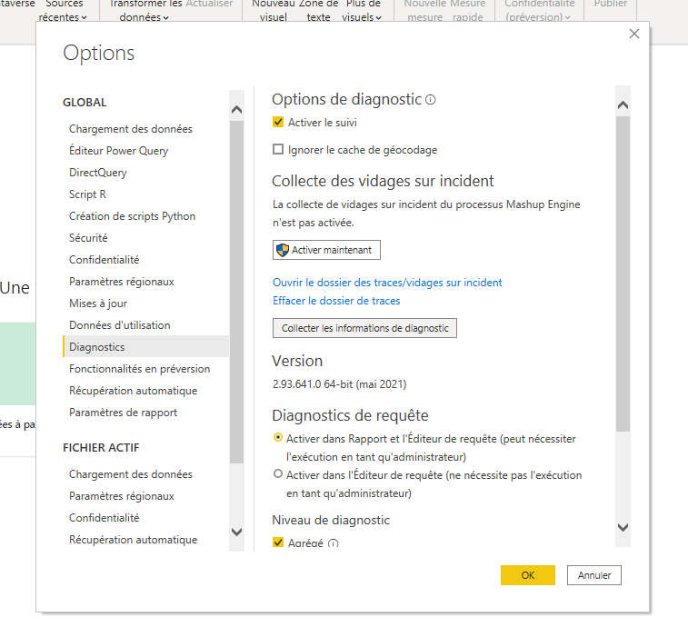

# Connector development

If you want to modify the connector, you'll have to install:
- [Visual Studion 2019](https://visualstudio.microsoft.com/fr/downloads/)
- the [Power Query SDK](https://docs.microsoft.com/en-us/power-query/installingsdk)

You can then open the solution located in [Braincube.sln](Braincube.sln). You should be able to build immediately.

Debugging it is HARD. I'll let the reader find out if he can easily. I couldn't.

## For test in local
 - You have to enable the "Uncertified connectors" in the Security Options of Power BI in Options >> Global >> Security >> Data Extensions (See chapter "Install the self signed version" in Readme.md for more detail)
 - After your compile your code go to Braincube\bin\Debug of your source directory
 - Copy Braincube.mez to %USERHOME%\Documents\Power BI Desktop\Custom Connectors (Create dir if it not exist)
 - Advice: You can update the .mez without reboot PowerBi Desktop ;-)

## delete the apikey
In PowerBi the apiKey are saved like a "metadata", for delete it and api key popup of the braincube connector show it, you need to go in "Files >> Parameters >> parameters of data src"
and delete the value saved.

## Almost debug ...
 - In the code add Diagnostics.Trace(...) , but we need to return it in variable, and you need this variable are "let" in the end of your query ...
 - For exemple, in the end of method GetVariableContent, you can add this line tmp = Diagnostics.Trace(TraceLevel.Information, "MGI :: " & Date.ToText(endDate, "yyyy/MM/dd "), () => result, true)
And updte the last line from "in result" to "in tmp".
 - For see the log, you need to activate diagnostics in your PowerBi Desktop (Warning: Enable tracing option will be reset when the Power BI Desktop instance is closed. To enable tracing, the option needs to be manually set every time Power BI Desktop is opened.)
   
 - After you execute the code with your "log" , you need to go to C:\Users\User\Microsoft\Power BI Desktop Store App\Traces (Or in same windows for activate it, you have a link "go to traces directory")
 - In this dir, you find a file "Microsoft.Mashup.Container.NetFXwithmanynumber" with your log.
 - Advice: Flag your log with a simply code (like your trigramme), because this file contains many lines ;-)
 - Warning: The trace works only the log contains "real" powerBi text :-(

# Virtualbox configuration
## Screen resolution
 - In image when is launched, go to menu "périphériques", and clic on "Insérer l'image Cd des additions invités"
 - Install all
 - After the reboot you can up the screen resolution

# Connector signage

This connector must be Self-signed by a developer certificate. This allows client to trust that the extension was actually created by us (Braincube) by verifying the signature of the extension against a thumbprint.

This all starts at this page: https://docs.microsoft.com/en-us/power-query/handlingconnectorsigning

## Signing Cert 

/!\ To retrieve the certificate, contact a SysAdmin and ask him to sign the certificate. The certificate is located in the admin's password stash

You will first have to generate a signing certificate, if there is not one already existing (hint: it should already exist if there has been at least one public release of the Braincube connector).

In any case, you should generate it like this:

```powershell
New-SelfSignedCertificate -Type CodeSigningCert -FriendlyName "BraincubeSigning" -CertStoreLocation Cert:\CurrentUser\My -Subject "Braincube Connector Signing Cert"


   PSParentPath : Microsoft.PowerShell.Security\Certificate::CurrentUser\My

Thumbprint                                Subject
----------                                -------
xxx                                       CN=Braincube Connector Signing Cert

```

Once created, you have to export it to PFX format:

https://superuser.com/a/1099602

In a powershell:

```powershell
cd Cert:\CurrentUser\My\
dir # should show the braincube certificate, copy its ID
# now export the certificate and its private key to your home directory:
Export-PfxCertificate -Cert .\THE_ID_OF_THE_CERT -FilePath $home\cert.pfx -Password (ConvertTo-SecureString -String 'A_STRONG_PASSWORD' -AsPlainText -Force)
```


## Sign the actual exe

You will have to download MakePQX and extract it somewhere

Go to https://aka.ms/makepqx to download the Zip containing MakePQX and extract it.

Then, you build the solution of the extension in Release mode and issue this command:

```powershell
C:\MakePQX_Release\MakePQX.exe pack -mz .\Braincube\bin\Release\Braincube.mez -c $home\cert.pfx -p 'THE_PREVIOUS_STRONG_PASSWORD' -t Braincube.pqx
```

This will result in a `Braincube.pqx` file in the current folder which is signed by your certificate.

You can verify the signature with:

```powershell
C:\MakePQX_Release\MakePQX.exe verify .\Braincube.pqx

{
  "SignatureStatus": "Success",
  "CertificateStatus": [
    {
      "Issuer": "CN=Braincube Connector Signing Cert",
      "Thumbprint": "YOUR THUMBPRINT",
      "Subject": "CN=Braincube Connector Signing Cert",
      "NotBefore": "2021-03-22T11:53:10+01:00",
      "NotAfter": "2022-03-22T12:13:10+01:00",
      "Valid": false,
      "Parent": null,
      "Status": "UntrustedRoot"
    }
  ]
}
```
