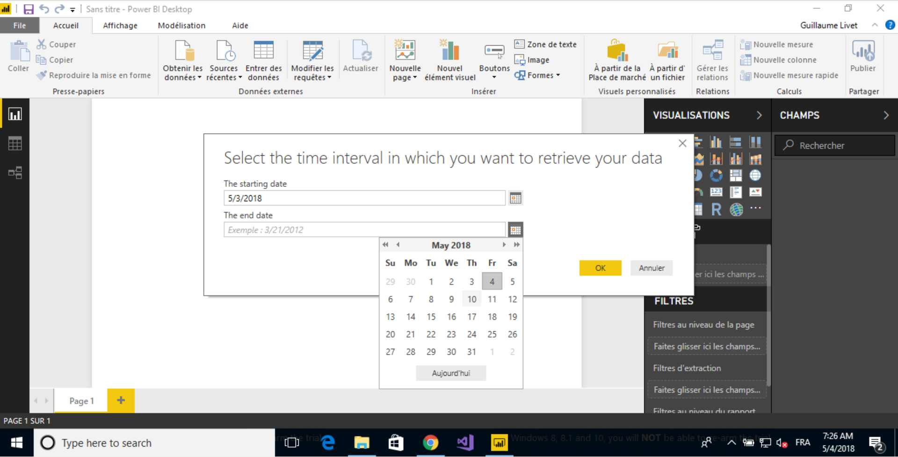
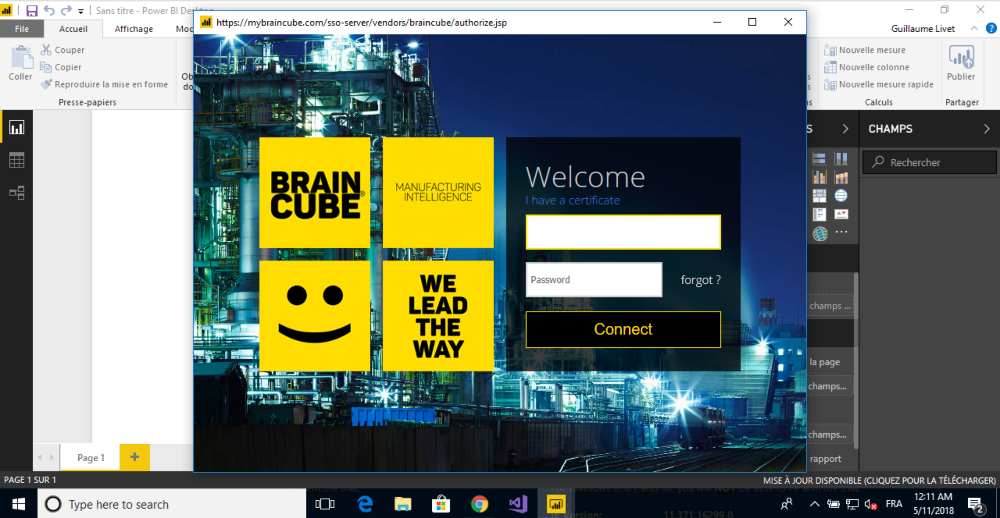
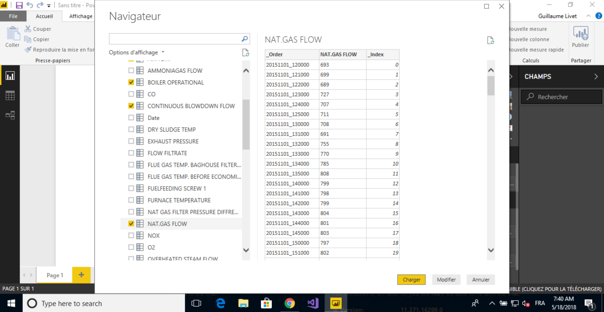

# 
<b>Power BI</b> 

## The software

<a href="https://powerbi.microsoft.com/">Power BI</a> is a software with a desktop application. 
It allows you to import data and manipulate, analyze, visualize it. It also proposes a suite of marketing analytics 
that provides insights throughout your organization.

## The connector

### Get your connector

You can get your connector here

--------

### How to use it?

* **Step 1**

    > Launch the Braincube connector. You will find it in the Get Data, Other.
    
    
    
* **Step 2**

    > Choose a time interval for your data
    
    
* **Step 3**

    > If you’re not already connected, authentificate with your Braincube account and click connected
    
    
* **Step 4**

    > Select the data you want to retrieve and validate
    
    
You can then use your data in Power BI Desktop as you wish.

-------

## Issue

| Version | Description | Solution | Date
|----|----|----|----
| 1.0.0 | Access forbidden when you try to get a variable | Cancel the connection and refresh the variable | 14/05/2017
