# 
<b>Power BI</b> 

## The software

<a href="https://powerbi.microsoft.com/">Power BI</a> is a software with a desktop application.
It allows you to import data and manipulate, analyze, visualize it. It also proposes a suite of marketing analytics
that provides insights throughout your organization.

## The connector

### Install the connector

There are two ways to install the connector:

- Using the Self-Signed version, for which you will have to add a Window Registry entry. [Here](#install-the-self-signed-version)

- Using the non-signed version, for which you'll have to reduce the security requirements of PowerBi. [There](#install-the-unsigned-version)

### Install the self signed version

- Retrieve the Regedit file [here](https://github.com/braincube-io/power-bi-connector/raw/master/TrustedCertificateThumbprints.reg) and double click to install it.

  Otherwise if you don't trust regedit files, simply add a MultiString value named `TrustedCertificateThumbprints` and containing our thumbprint `8246236ABB1156171091CF753CE7837D47FCC742` in the `HKEY_LOCAL_MACHINE\SOFTWARE\Policies\Microsoft\Power Bi Desktop` Registry folder.

  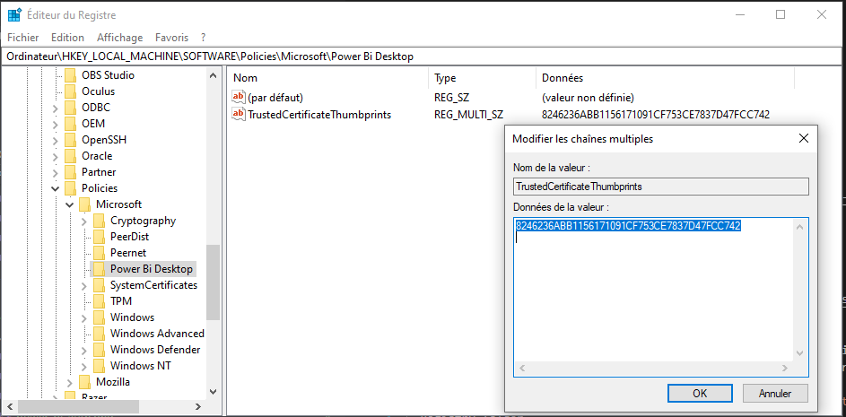

- Then download the connector [here](https://github.com/braincube-io/power-bi-connector/raw/master/releases/Braincube2.0.0.pqx).

  And install this file into your `%USERHOME%\Documents\Power BI Desktop\Custom Connectors` folder.

- Restart Power Bi and the connector should show up in the list.

### Install the unsigned version

- You have to enable the "Uncertified connectors" in the Security Options of Power BI:

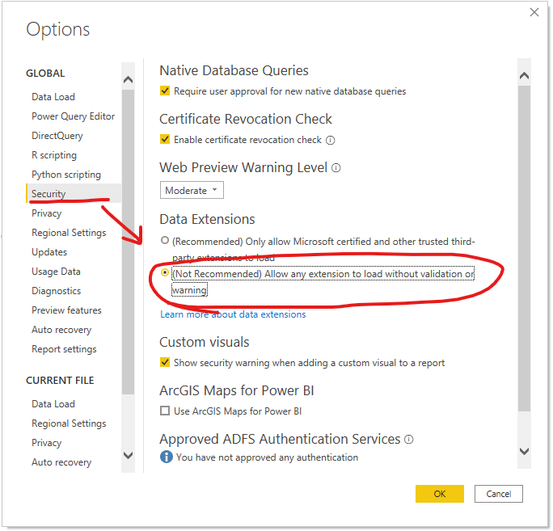

- Then download the unsigned connector [here](https://github.com/braincube-io/power-bi-connector/raw/master/releases/Braincube2.0.0.mez).

- And install this file into your `%USERHOME%\Documents\Power BI Desktop\Custom Connectors` folder.

- Restart Power Bi and the connector should show up in the list.
--------

### How to use it?

* **Step 1**

    > Launch the Braincube connector. You will find it in the Get Data, Other.
    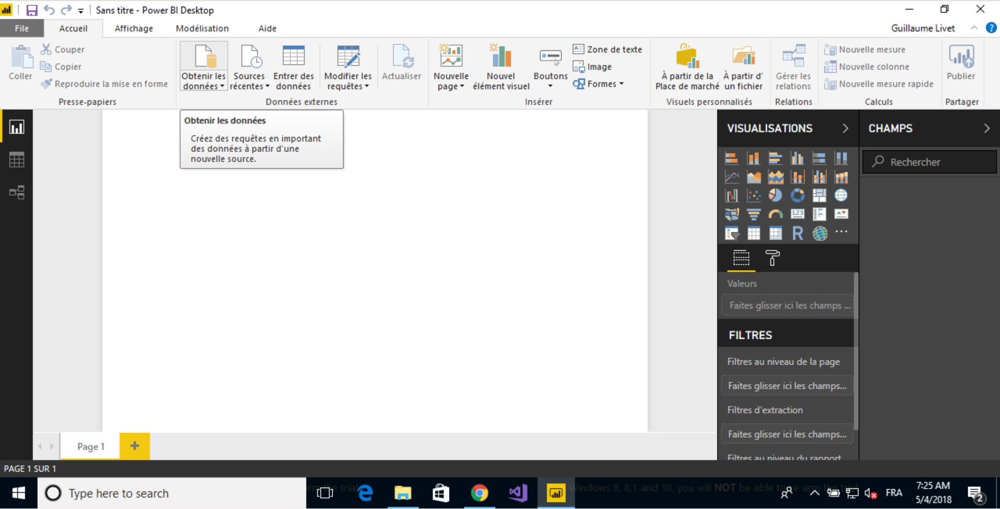
    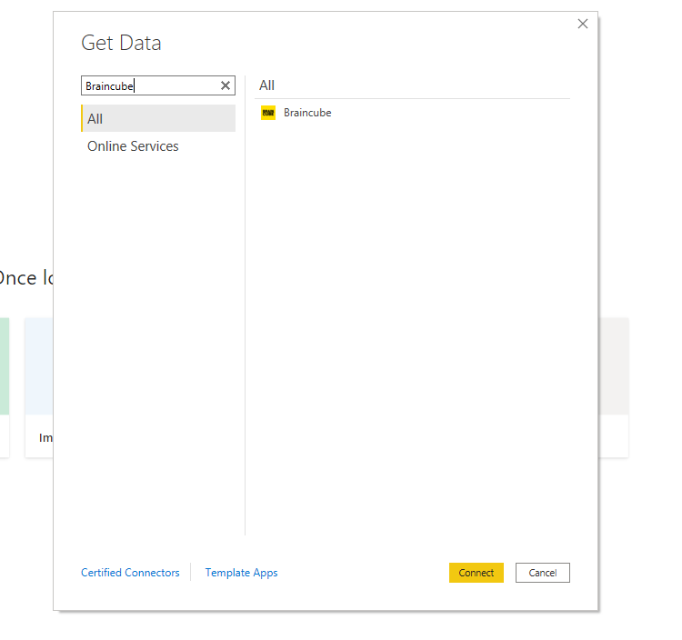

* **Step 2**

    > If you have not yet set up a Braincube connection, you'll have to start one now. You have to have created an Access Token (see [below](#creating-an-access-token))
    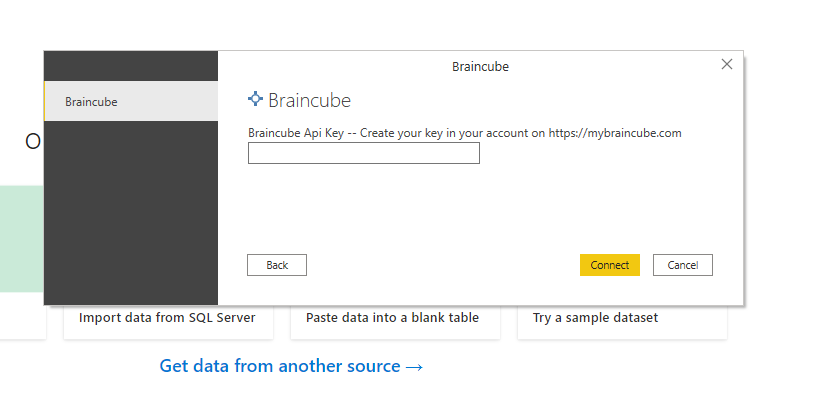

* **Step 3**

    > Select the data you want to retrieve (Braincube, Base, Sliding Period, and Variable) and validate
    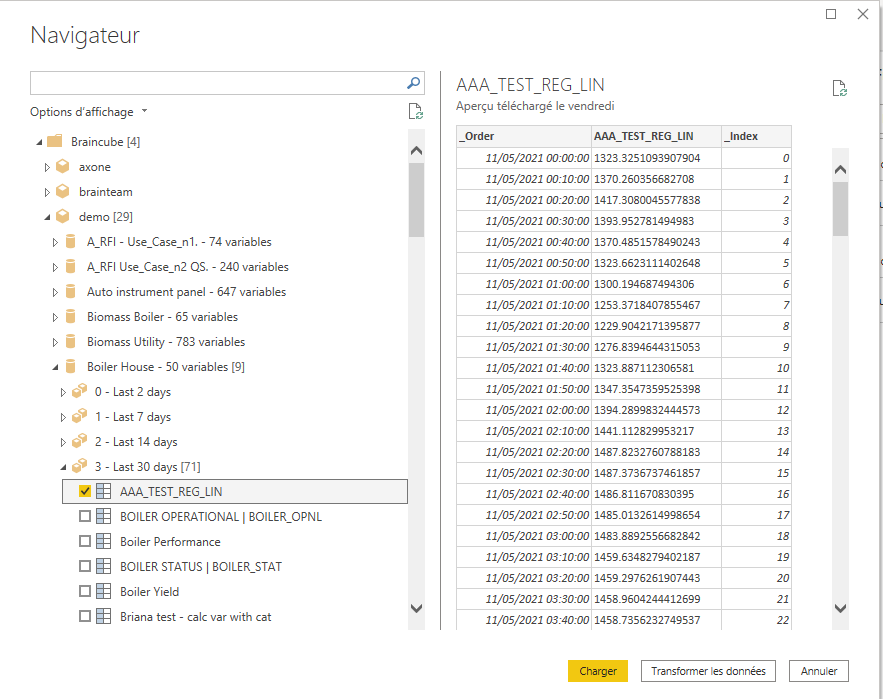

You can then use your data in Power BI Desktop as you wish.
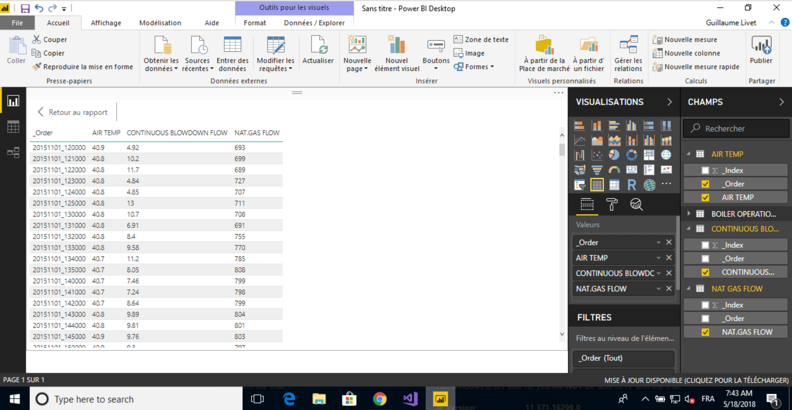

-------

# Creating an Access Token

The process is simple:

- Go to your [profile access tokens page](https://cdn.mybraincube.com/account/access-tokens)

- Click on the "+" sign to create a new Api Key

  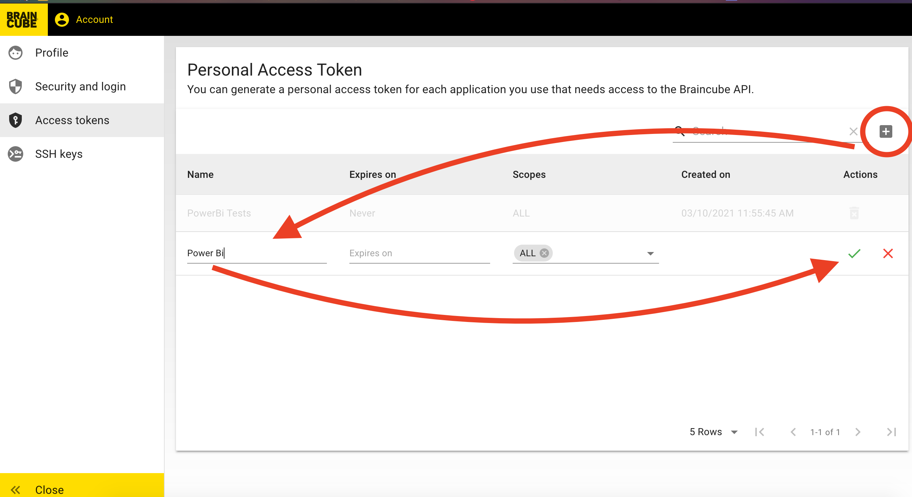

- The key is created and you get to copy it.

  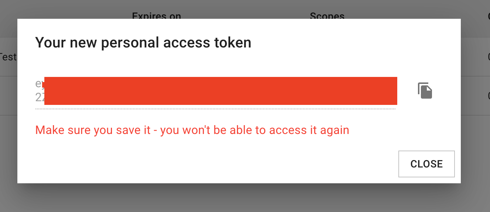

**Be careful, the key will only be displayed once! Copy it somewhere safe**
## Issue

| Version | Description | Solution | Date
|----|----|----|----
| 1.0.0 | Access forbidden when you try to get a variable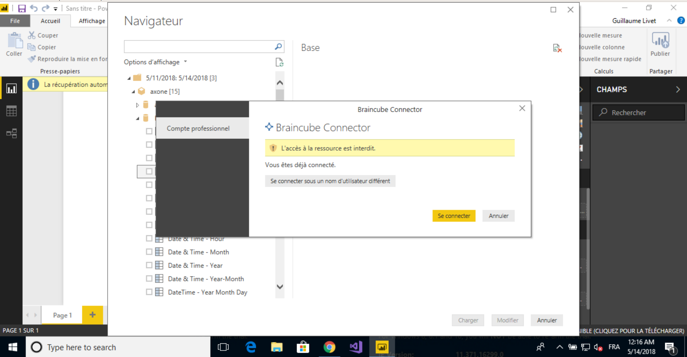 | Cancel the connection and refresh the variable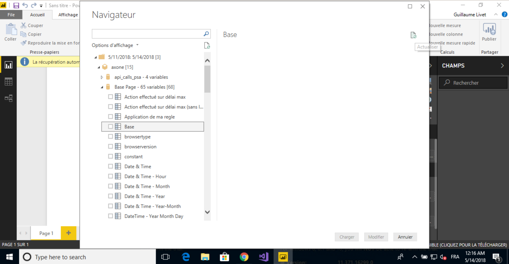 | 14/05/2018

## Release History

- **March 2021**: Version 2.0.0 using ApiKey connection
- **June 2018**: Version 1.0.0 using Oauth connection

Version 1.0.0 is still available [here](https://github.com/Gui13/power-bi-connector/raw/master/releases/Braincube1.0.0.mez).
